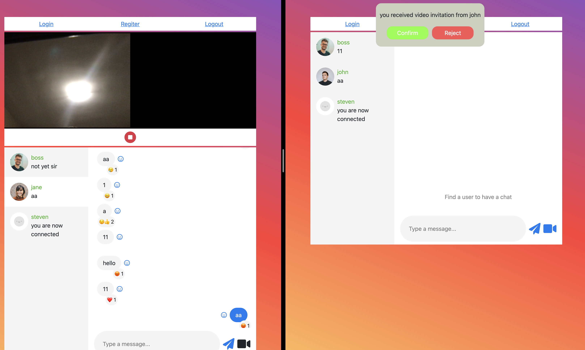
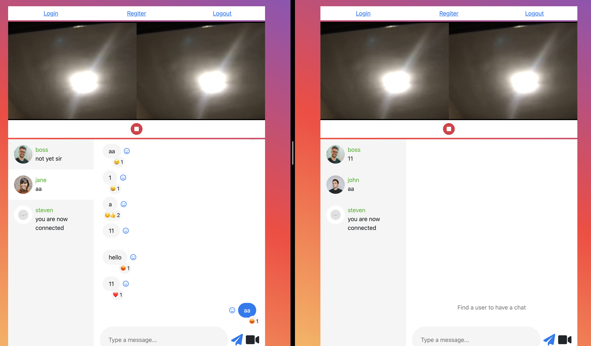

# ChatApp
•	This project is a chat web app like messenger achieving real-time text chat, reaction and video chat

## Table of contents
* [General info](#General-info)
* [Technologies](#Technologies)
* [Setup](#Setup)


## General-info
1. User Login.
<p align="center">

<p>
2. Register User.
<p align="center">

<p>
3. User List and messages container.
<p align="center">

<p>
4. Video Chat Invitation.
<p align="center">

<p>
5. Video Chat.
<p align="center">

<p>


## Technologies
Project is created with:
* React
* Apollo GraphQL server
* MySQL, Sequelize
* WebSocket
* WebRTC

## Setup
#### Frontend 
```bash
npm install
npm start
```
#### Backend 
```bash
npm run dev
```
